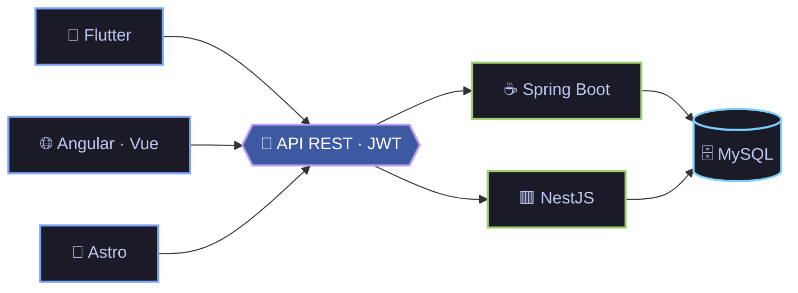
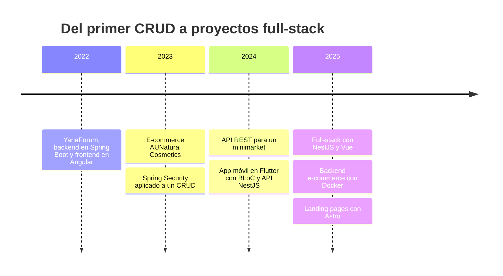

<!-- ===== HEADER ===== -->
<div align="center">


<a href="https://github.com/alejandromacedopa">
  
</a>

<p>
  Estudiante de <b>Ingeniería de Sistemas</b> enfocado en construir<br/>
  <b>APIs sólidas</b> · <b>apps móviles modernas</b> · <b>experiencias web profesionales</b>
</p>

<p>
  <a href="mailto:macedoalejandro12@gmail.com">
    
  </a>
  <a href="https://www.linkedin.com/in/tu-usuario-linkedin"> <!-- ⚠️ CAMBIA por tu usuario real -->
    
  </a>
  <a href="https://github.com/alejandromacedopa">
    
  </a>
</p>

<p>
  
  
  
</p>

</div>

<br/>

<!-- ===== SOBRE MÍ ===== -->
## 👨‍💻 Sobre mí

```js
const alejandro = {
  nombre:         "Alejandro Macedo Paredes",
  carrera:        "Ingeniería de Sistemas",
  edad:           23,
  ubicacion:      "Perú 🇵🇪",
  idiomas:        ["Español (nativo)", "Inglés (intermedio)"],
  backend:        ["Java · Spring Boot", "TypeScript · NestJS"],
  mobile:         ["Flutter · Dart"],
  web:            ["Angular", "Vue", "Astro"],
  aprendiendo:    ["Microservicios", "Clean Architecture", "Seguridad avanzada"],
  motivacion:     "Resolver problemas con tecnología y aprender algo nuevo cada día",
  fueraDelCodigo: ["🏋️ Gimnasio", "⚽ Fútbol"],
};
```

> 💡 Me gusta combinar **buenas prácticas**, **rendimiento** y **diseño limpio**.
> Disfruto trabajar en equipo, documentar bien lo que hago y entregar soluciones que de verdad se puedan usar.

<br/>

<!-- ===== TECH STACK ===== -->
## 🛠️ Tech Stack

<div align="center">
<table>
  <tr>
    <td align="center" width="170"><b>🧬 Lenguajes</b></td>
    <td></td>
  </tr>
  <tr>
    <td align="center"><b>🔧 Backend</b></td>
    <td></td>
  </tr>
  <tr>
    <td align="center"><b>📱 Mobile</b></td>
    <td></td>
  </tr>
  <tr>
    <td align="center"><b>🌐 Frontend</b></td>
    <td></td>
  </tr>
  <tr>
    <td align="center"><b>☁️ Infra & servicios</b></td>
    <td></td>
  </tr>
  <tr>
    <td align="center"><b>⚙️ Herramientas</b></td>
    <td></td>
  </tr>
</table>
</div>

<details>
<summary><b>📖 Ver detalle por área</b></summary>
<br/>

| Área | Lo que domino |
|:--|:--|
| **Backend** | Diseño de **APIs RESTful** · Spring Boot + JPA + **Spring Security** · NestJS + TypeORM · autenticación **JWT** y roles · bases de datos relacionales (**MySQL**) |
| **Mobile** | Apps híbridas con **Flutter** para Android e iOS · estado con **BLoC** · inyección de dependencias con `get_it` · consumo de APIs reales |
| **Frontend** | **Angular**, **Vue** y **Astro** · Responsive Design y maquetación limpia · enfoque en **UI/UX** · semántica y accesibilidad |
| **Infra** | **Docker** para empaquetar backends · **Firebase** como servicio complementario |

</details>

<br/>

<!-- ===== CÓMO CONSTRUYO ===== -->
## 🧩 Cómo construyo



<br/>

<!-- ===== LO QUE HAGO ===== -->
## 🚀 Lo que hago

<table>
  <tr>
    <td width="50%" valign="top">
      <h4>⚙️ APIs REST</h4>
      Java + Spring Boot y NestJS, con seguridad JWT, roles y persistencia en MySQL.
    </td>
    <td width="50%" valign="top">
      <h4>📱 Apps móviles</h4>
      Flutter conectado a backends reales, con BLoC y una arquitectura desacoplada.
    </td>
  </tr>
  <tr>
    <td width="50%" valign="top">
      <h4>🌐 Interfaces web</h4>
      Landing pages y aplicaciones modernas, responsivas y pensadas para la experiencia de usuario.
    </td>
    <td width="50%" valign="top">
      <h4>🧼 Código limpio</h4>
      Patrones y principios de <b>Clean Code</b> para escribir software mantenible.
    </td>
  </tr>
</table>

<br/>

<!-- ===== APRENDIENDO ===== -->
## 🌱 Aprendiendo ahora


<br/>

<!-- ===== PROYECTOS ===== -->
## 📂 Proyectos destacados

<table>
  <tr>
    <td width="33%" valign="top">
      <h3>🛒 <a href="https://github.com/alejandromacedopa/minimarketinnovateapi">Minimarket API</a></h3>
      <p>API REST con CRUD para la gestión de un minimarket.</p>
      <p>
        
        
        
      </p>
      
    </td>
    <td width="33%" valign="top">
      <h3>🔐 <a href="https://github.com/alejandromacedopa/SecuritySpringCRUD">Spring Security CRUD</a></h3>
      <p>Implementación de Spring Security sobre un CRUD, con vistas Thymeleaf.</p>
      <p>
        
        
        
      </p>
      
    </td>
    <td width="33%" valign="top">
      <h3>📱 <a href="https://github.com/alejandromacedopa/demoviewshopify">Demo Shopify</a></h3>
      <p>App móvil híbrida (iOS y Android): demo de una tienda online que consume una API NestJS con auth JWT.</p>
      <p>
        
        
        
      </p>
      
    </td>
  </tr>
  <tr>
    <td width="33%" valign="top">
      <h3>🧾 <a href="https://github.com/alejandromacedopa/backend-app-op-vip">Backend E-commerce</a></h3>
      <p>Backend de un e-commerce administrativo con autenticación JWT.</p>
      <p>
        
        
        
      </p>
      
    </td>
    <td width="33%" valign="top">
      <h3>💎 <a href="https://github.com/alejandromacedopa/oasispremiumbackend">Oasis Premium</a></h3>
      <p>Proyecto full-stack: backend en NestJS y frontend en Vue.</p>
      <p>
        
        
        
      </p>
      <a href="https://github.com/alejandromacedopa/oasispremiumbackend">Backend</a> ·
      <a href="https://github.com/alejandromacedopa/oasis-premiun-m-vue">Frontend</a>
    </td>
    <td width="33%" valign="top">
      <h3>🚀 Landing pages con Astro</h3>
      <p>Sitios rápidos y responsivos para distintos negocios.</p>
      <p>
        
        
      </p>
      <a href="https://github.com/alejandromacedopa/tilapiasoft-landing">TilapiaSoft</a> ·
      <a href="https://github.com/alejandromacedopa/casahome-landing">CasaHome</a> ·
      <a href="https://github.com/alejandromacedopa/constructoraandina">Constructora Andina</a> ·
      <a href="https://github.com/alejandromacedopa/parfumtppv1">Parfum</a>
    </td>
  </tr>
</table>

<sub>➕ Más en mi perfil:
<a href="https://github.com/alejandromacedopa/AUNatural-Cosmetics">AUNatural Cosmetics</a> ·
<a href="https://github.com/alejandromacedopa/backend-YF">YanaForum (backend)</a> ·
<a href="https://github.com/alejandromacedopa/fronted-YF">YanaForum (frontend)</a> ·
<a href="https://github.com/alejandromacedopa?tab=repositories">ver todos mis repositorios →</a></sub>

<br/>

<!-- ===== TRAYECTORIA ===== -->
## 🗺️ Mi trayectoria



<br/>

<!-- ===== ACTIVIDAD ===== -->
## 📊 Actividad en GitHub

<div align="center">

<!-- 🐍 Se genera con el workflow .github/workflows/snake.yml (ver instrucciones) -->
<picture>
  <source media="(prefers-color-scheme: dark)" srcset="https://raw.githubusercontent.com/alejandromacedopa/alejandromacedopa/output/github-snake-dark.svg" />
  <source media="(prefers-color-scheme: light)" srcset="https://raw.githubusercontent.com/alejandromacedopa/alejandromacedopa/output/github-snake.svg" />
  
</picture>

<br/>


<!--
  Tarjetas de github-readme-stats: la instancia pública de Vercel suele estar
  saturada (error 503). Cuando responda, o si despliegas tu propia instancia,
  descomenta este bloque.

<br/>


-->

</div>

<br/>

<!-- ===== CONTACTO ===== -->
## 📫 ¿Hablamos?

Si tienes una idea, un proyecto o simplemente quieres conversar de tecnología, escríbeme:

<div align="center">

<a href="mailto:macedoalejandro12@gmail.com"></a>

<br/><br/>

🤝 *Siempre abierto a colaborar, compartir lo que sé y aprender de otros devs.*

</div>

<!-- ===== FOOTER ===== -->

