<div align="center">


<p>
  Desarrollador <b>Full Stack</b> en Perú, enfocado en construir<br/>
  <b>APIs sólidas</b> · <b>sistemas SaaS y a medida</b> · <b>experiencias web profesionales</b>
</p>

<a href="mailto:macedoalejandro12@gmail.com"></a>
<a href="https://www.linkedin.com/in/alejandromacedop"></a>
<a href="https://github.com/alejandromacedopa"></a>

<p>
  
  
  
</p>

</div>

<br/>

<!-- 01 · SOBRE MÍ -->
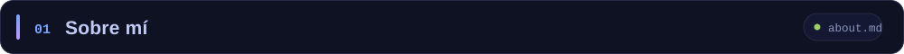

```js
const alejandro = {
  nombre:         "Alejandro Macedo Paredes",
  rol:            "Desarrollador Full Stack",
  edad:           24,
  ubicacion:      "Perú 🇵🇪",
  idiomas:        ["Español (nativo)", "Inglés (intermedio)"],
  backend:        ["TypeScript · NestJS", "Java · Spring Boot"],
  baseDeDatos:    ["PostgreSQL (principal)", "MySQL"],
  orm:            ["Prisma", "TypeORM", "JPA"],
  web:            ["Angular", "Next.js", "Astro", "Vue"],
  mobile:         ["Flutter · Dart"],
  profundizando:  ["Microservicios", "Clean Architecture", "Seguridad avanzada"],
  motivacion:     "Resolver problemas con tecnología y aprender algo nuevo cada día",
  fueraDelCodigo: ["🏋️ Gimnasio", "⚽ Fútbol"],
};
```

> Me gusta combinar **buenas prácticas**, **rendimiento** y **diseño limpio**.
> Disfruto trabajar en equipo, documentar bien lo que hago y entregar soluciones que de verdad se puedan usar.

<br/>

<!-- 02 · STACK -->


<div align="center">
<table>
  <tr>
    <td align="right" width="190"><b>Lenguajes</b></td>
    <td></td>
  </tr>
  <tr>
    <td align="right"><b>Backend</b></td>
    <td></td>
  </tr>
  <tr>
    <td align="right"><b>Bases de datos</b></td>
    <td>&nbsp; <sub><b>PostgreSQL</b> como principal</sub></td>
  </tr>
  <tr>
    <td align="right"><b>Frontend</b></td>
    <td></td>
  </tr>
  <tr>
    <td align="right"><b>Mobile</b></td>
    <td></td>
  </tr>
  <tr>
    <td align="right"><b>Infra y CI</b></td>
    <td></td>
  </tr>
  <tr>
    <td align="right"><b>Herramientas</b></td>
    <td></td>
  </tr>
</table>
</div>

<details>
<summary><b>Ver detalle por área</b></summary>
<br/>

| Área | Lo que domino |
|:--|:--|
| **Backend** | **NestJS** + Prisma / TypeORM · Spring Boot + JPA + **Spring Security** · APIs RESTful · autenticación **JWT**, roles y permisos · arquitecturas **multi-tenant** |
| **Datos** | **PostgreSQL** como base principal · migraciones con Prisma · Redis para colas (BullMQ) y caché · MySQL en proyectos previos |
| **Frontend** | **Angular**, **Next.js** y **Astro** con Tailwind · Responsive Design y maquetación limpia · enfoque en **UI/UX** |
| **Mobile** | Apps híbridas con **Flutter** para Android e iOS · estado con **BLoC** · inyección de dependencias con `get_it` |
| **Infra** | **Docker** y Docker Compose · Nginx · CI con **GitHub Actions** · Firebase como servicio complementario |

</details>

<br/>

<!-- 03 · FOCO ACTUAL -->
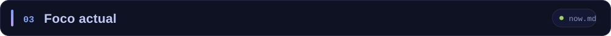

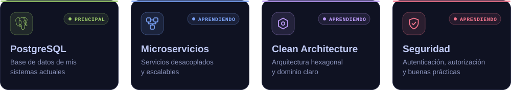

<br/>

<!-- 04 · CÓMO CONSTRUYO -->
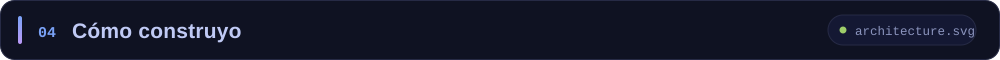


<br/>

<!-- 05 · SISTEMAS A MEDIDA Y SAAS (repos privados) -->
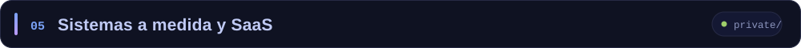

<div align="center">
<sub>🔒 Repositorios privados de proyectos reales · todos sobre <b>PostgreSQL</b></sub>
<br/>


</div>

<br/>

<!-- 06 · PROYECTOS PÚBLICOS -->
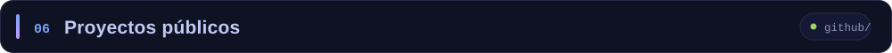

<div align="center">
<a href="https://github.com/alejandromacedopa/minimarketinnovateapi">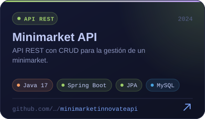</a>
<a href="https://github.com/alejandromacedopa/SecuritySpringCRUD">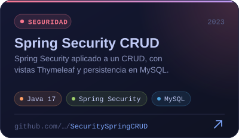</a>
<a href="https://github.com/alejandromacedopa/demoviewshopify">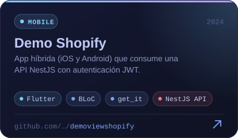</a>
<a href="https://github.com/alejandromacedopa/backend-app-op-vip">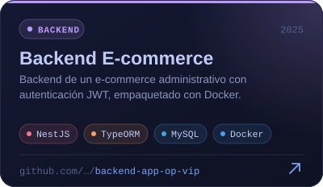</a>
<a href="https://github.com/alejandromacedopa/oasispremiumbackend">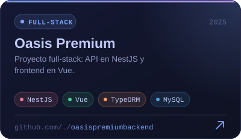</a>
<a href="https://github.com/alejandromacedopa?tab=repositories&q=landing">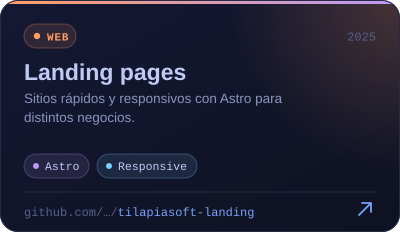</a>

<sub>
<b>También:</b>
<a href="https://github.com/alejandromacedopa/oasis-premiun-m-vue">Oasis (frontend Vue)</a> ·
<a href="https://github.com/alejandromacedopa/AUNatural-Cosmetics">AUNatural Cosmetics</a> ·
<a href="https://github.com/alejandromacedopa/backend-YF">YanaForum</a> ·
<a href="https://github.com/alejandromacedopa?tab=repositories"><b>ver todos →</b></a>
</sub>
</div>

<br/>

<!-- 07 · TRAYECTORIA -->
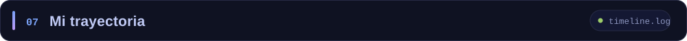


<br/>

<!-- 08 · ACTIVIDAD -->
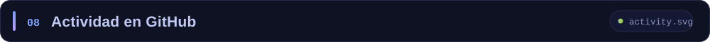

<div align="center">

<!-- 🐍 Se genera con .github/workflows/snake.yml (ejecútalo una vez desde la pestaña Actions) -->
<picture>
  <source media="(prefers-color-scheme: dark)" srcset="https://raw.githubusercontent.com/alejandromacedopa/alejandromacedopa/output/github-snake-dark.svg" />
  <source media="(prefers-color-scheme: light)" srcset="https://raw.githubusercontent.com/alejandromacedopa/alejandromacedopa/output/github-snake.svg" />
  
</picture>


<!--
  Tarjetas de github-readme-stats: la instancia pública de Vercel suele estar
  saturada (error 503). Descomenta este bloque cuando responda o si despliegas
  tu propia instancia.

<br/>


-->

</div>

<br/>

<!-- 09 · CONTACTO -->
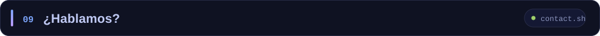

<div align="center">

<p>Si tienes una idea, un proyecto o quieres conversar de tecnología, escríbeme.<br/>Siempre abierto a colaborar y a aprender de otros devs.</p>

<a href="mailto:macedoalejandro12@gmail.com"></a>
<a href="https://www.linkedin.com/in/alejandromacedop"></a>
<a href="https://github.com/alejandromacedopa"></a>

</div>

<br/>

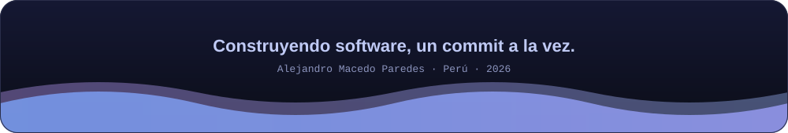
